



 

## Por onde começar

| Quero ver... | Projeto | Foco |
| :--- | :--- | :--- |
| Regras de negócio, segurança e SaaS multi-tenant | **[Skevia](#skevia)** | Java, Spring Boot, PostgreSQL, RLS e agendamentos |
| APIs, WebSocket e comunicação em tempo real | **[AssessFlow](#assessflow)** | Spring Boot, sessões ao vivo e testes |
| Backend em produção e integração com cloud | **[503](#503)** | API Spring Boot, publicação, Azure e Cloudflare |
| Java, concorrência e tolerância a falhas | **[Distributed Quiz](#distributed-quiz)** | TCP/UDP, replicação e failover |
| Interfaces, websites e design | **[Projetos frontend](#frontend-e-websites)** | Astro, React, Next.js e websites para clientes |

## Sobre mim

Sou Davi Gama, licenciado em Engenharia Informática pelo ISEC, em Coimbra. Desenvolvo aplicações backend com Java e Spring Boot, assim como websites e produtos fullstack. Tenho experiência em ambiente empresarial, trabalho em equipa e desenvolvimento freelance, desde o levantamento de requisitos até à publicação. Interesso-me por APIs, bases de dados, arquitetura de software e regras de negócio.

## Tecnologias

| Área | Tecnologias |
| :--- | :--- |
| Linguagens | Java, C#, TypeScript, JavaScript, Python, C/C++, SQL |
| Backend e dados | Spring Boot, Spring Data JPA, Hibernate, ASP.NET Core, FastAPI, PostgreSQL, MySQL, SQL Server, SQLite |
| Frontend | React, Next.js, Astro, Blazor, JavaFX |
| Ferramentas | Git, Maven, Gradle, Docker, JUnit, Testcontainers, CI/CD, Azure, Cloudflare |

Material complementar: capturas, estudos e arquitetura

- [Galeria de interfaces](portfolio/interfaces/README.md)
- [Casos de estudo](portfolio/02_Casos_de_Estudo.pdf)
- [Diagramas de arquitetura](portfolio/03_Arquiteturas.pdf)
- [Vistas técnicas](portfolio/04_Arquiteturas_Tecnicas.pdf)

## Backend e fullstack

### Skevia

**Fullstack | Produto e serviços para negócios**

Plataforma SaaS de agendamentos para vários negócios. Cada tenant gere serviços, profissionais, horários, clientes e marcações no seu próprio espaço. O Ícaro’s Barbershop é um dos negócios que solicitaram o serviço e é apresentado como exemplo, não como destinatário exclusivo da plataforma.

**Tecnologias:** Java, Spring Boot, PostgreSQL, Flyway, React, TypeScript, Cloudflare

<a href="assets/portfolio/multi-tenant-poster.webp">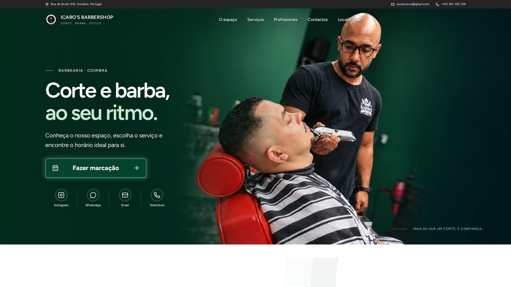</a>

Ver funcionalidades e implementação

- **Funcionalidades:** agendamento online, disponibilidade por profissional, backoffice, personalização do site e relatórios.
- **Backend:** regras de disponibilidade e conflitos, transações, isolamento de tenants, autenticação, RLS e contratos OpenAPI.
- **Frontend:** site público e painel de gestão, com componentes reutilizados no editor visual.

Ver demonstração animada

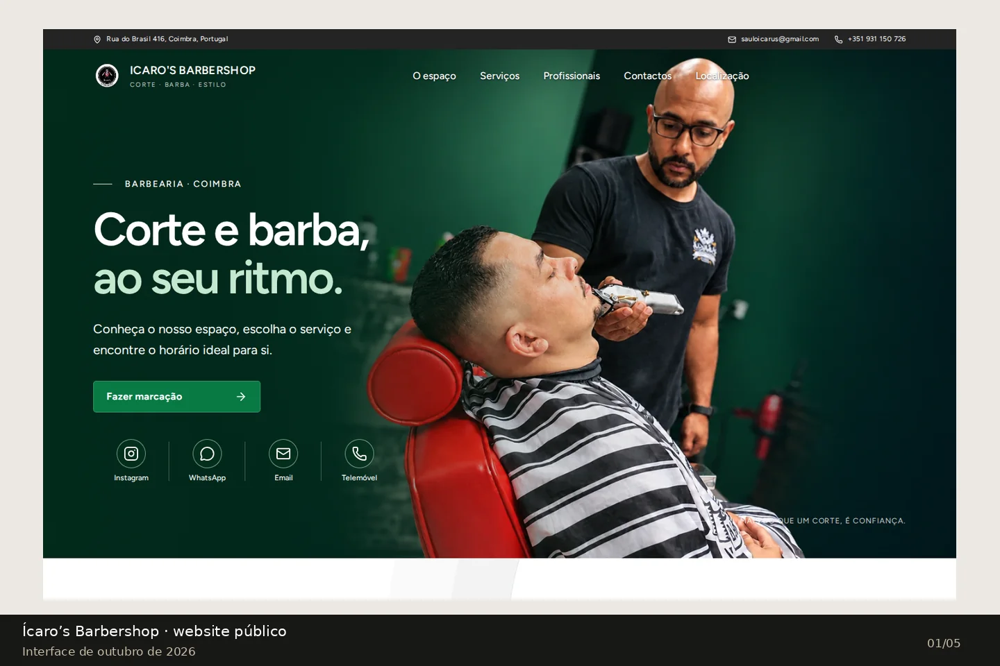

 

Ver arquitetura e detalhes técnicos

[Arquitetura](architecture/multi-tenant.svg) | [Vista técnica](architecture/technical/multi-tenant.svg) | [PNG da arquitetura](architecture/multi-tenant.png)

### AssessFlow

**Projeto pessoal | Fullstack**

Plataforma de avaliações com bancos de perguntas, sessões ao vivo e participação por código ou QR. Funciona na nuvem ou em rede local.

**Tecnologias:** Java 25, Spring Boot 4.1, PostgreSQL, React, WebSocket, STOMP

<a href="assets/portfolio/assessflow-poster.webp">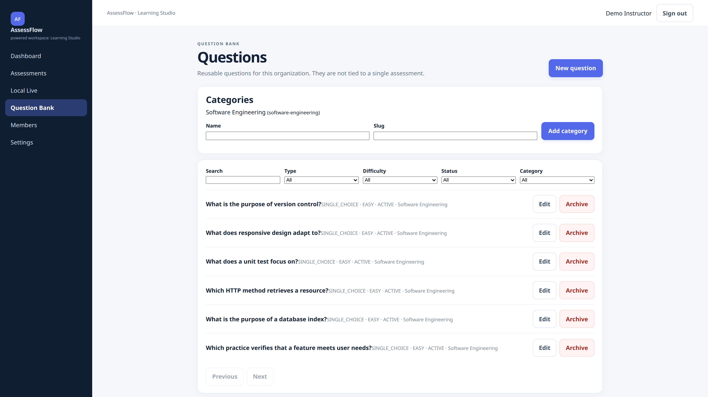</a>

Ver funcionalidades e implementação

- **Funcionalidades:** autoria de avaliações, sessões em tempo real, respostas, resultados e exportação CSV.
- **Backend:** organizações isoladas, permissões, API REST, WebSockets e persistência com Flyway.
- **Qualidade:** testes com Testcontainers e integração contínua. Redis e RabbitMQ são opções de escala, não dependências obrigatórias.

Ver demonstração animada

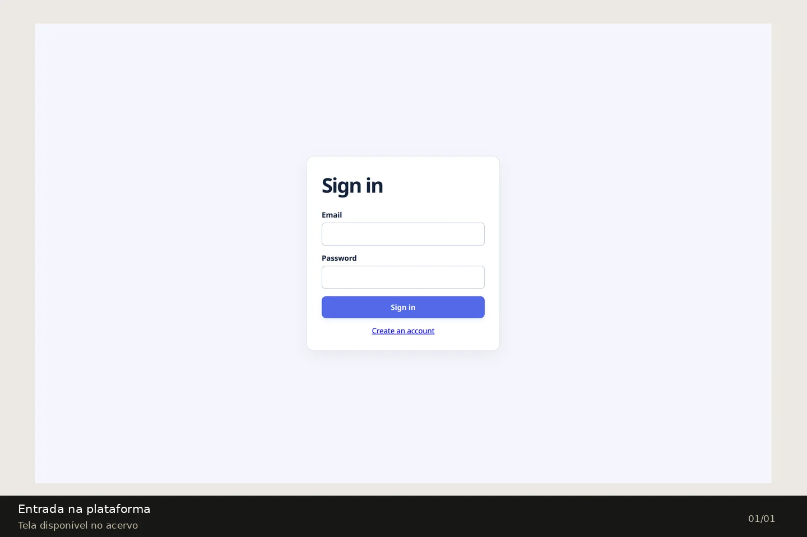

 

 

Ver arquitetura e detalhes técnicos

[Arquitetura](architecture/assessflow.svg) | [Vista técnica](architecture/technical/assessflow.svg) | [PNG da arquitetura](architecture/assessflow.png)

### 503

**Projeto pessoal | Fullstack**

Plataforma pessoal para gerir e publicar artigos. Inclui website público, backoffice de edição e API responsável pelas regras de publicação e persistência.

**Tecnologias:** Java 25, Spring Boot 4.1, PostgreSQL, Flyway, Astro, React, Azure, Cloudflare

Ver funcionalidades e implementação

- **Funcionalidades:** rascunhos, edição de artigos, publicação, capas e autenticação administrativa.
- **Backend:** API REST, regras editoriais, segurança, persistência e migrações.
- **Frontend:** site público em Astro e administração separada em React.

Ver demonstração animada

 

 

Ver arquitetura e detalhes técnicos

[Arquitetura](architecture/503.svg) | [Vista técnica](architecture/technical/503.svg) | [PNG da arquitetura](architecture/503.png)

## Java e sistemas distribuídos

### Distributed Quiz

**Java | Sistemas distribuídos**

Sistema de questionários para docentes e alunos com clientes JavaFX e servidores que suportam descoberta, replicação e recuperação após falhas.

**Tecnologias:** Java, JavaFX, TCP, UDP, multicast, SQLite, Maven

<a href="assets/portfolio/distributed-quiz-poster.webp">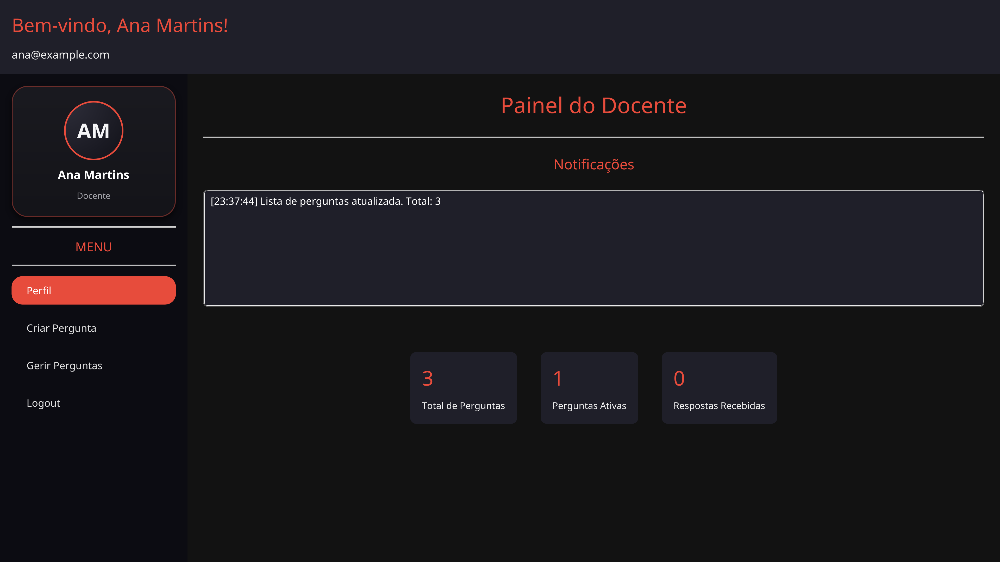</a>

Ver funcionalidades e implementação

- **Funcionalidades:** perguntas, respostas, códigos de acesso, estatísticas e notificações.
- **Arquitetura:** descoberta de serviços, replicação primário/backup, heartbeats, failover e reconexão.

Ver demonstração animada

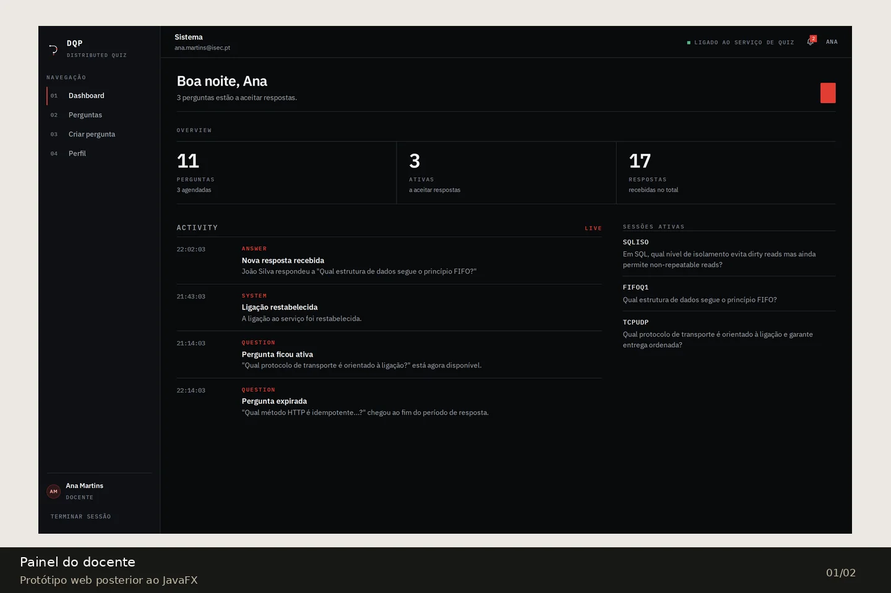

 

 

Ver arquitetura e detalhes técnicos

[Arquitetura](architecture/distributed-quiz.svg) | [Vista técnica](architecture/technical/distributed-quiz.svg) | [PNG da arquitetura](architecture/distributed-quiz.png)

## Outros projetos técnicos

Ver mais projetos académicos

### MyMEDIA

**.NET | Fullstack académico**

Marketplace académico de produtos multimédia, com loja pública, backoffice e API partilhada por várias interfaces.

**Tecnologias:** C#, ASP.NET Core, Blazor, EF Core, SQL Server

Ver funcionalidades e implementação

- **Funcionalidades:** produtos, favoritos, carrinho, encomendas e gestão administrativa.
- **Backend:** API REST, autenticação, permissões e persistência relacional.

Ver demonstração animada

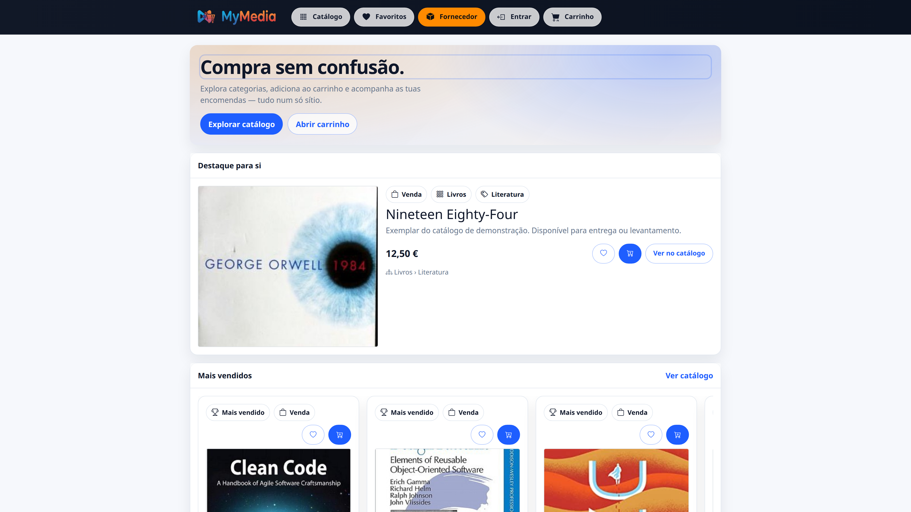

 

Ver arquitetura e detalhes técnicos

[Arquitetura](architecture/mymedia.svg) | [Vista técnica](architecture/technical/mymedia.svg) | [PNG da arquitetura](architecture/mymedia.png)

### JavaFX Chess

**Java | Desktop**

Aplicação de xadrez com validação de jogadas, regras completas, histórico, edição de posições e persistência local.

**Tecnologias:** Java, JavaFX, Maven, JUnit

<a href="assets/portfolio/javafx-chess-poster.webp">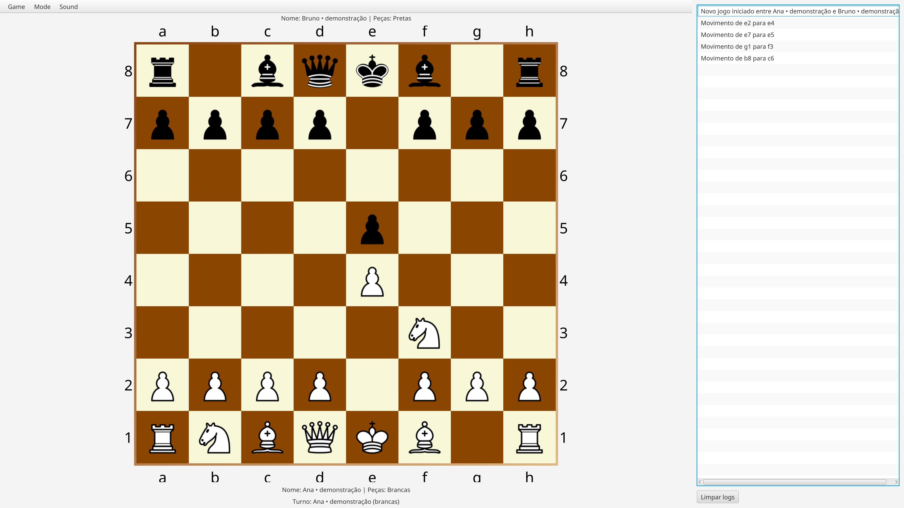</a>

Ver funcionalidades e implementação

- **Implementação:** regras de xeque, roque, promoção e fim de jogo.
- **Arquitetura:** MVC e padrões Facade, Memento e Observer; testes da lógica de jogo.

Ver demonstração animada

 

 

Ver arquitetura e detalhes técnicos

[Arquitetura](architecture/javafx-chess.svg) | [Vista técnica](architecture/technical/javafx-chess.svg) | [PNG da arquitetura](architecture/javafx-chess.png)

### SurpriseMe

**Java | Desktop**

Organizador de presentes com destinatários, ocasiões e histórico para apoiar a escolha de sugestões.

**Tecnologias:** Java, JavaFX, Maven

<a href="assets/portfolio/surpriseme-poster.webp">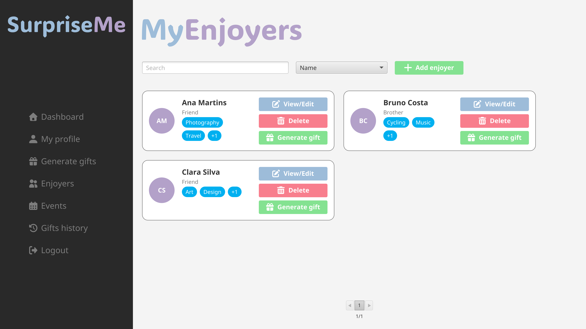</a>

Ver funcionalidades e implementação

- **Implementação:** gestão de pessoas, eventos e presentes, com persistência local.
- **Integração:** componente de sugestão isolado; a demonstração visual não executa a inferência externa.

Ver demonstração animada

 

 

Ver arquitetura e detalhes técnicos

[Arquitetura](architecture/surpriseme.svg) | [Vista técnica](architecture/technical/surpriseme.svg) | [PNG da arquitetura](architecture/surpriseme.png)

### Unix Topic Message Broker

**C | Sistemas operativos**

Broker local de mensagens por tópico, usando processos e mecanismos POSIX para publicação, subscrição e entrega concorrente.

**Tecnologias:** C, POSIX FIFOs, pthreads, select

<a href="assets/portfolio/unix-broker-poster.webp">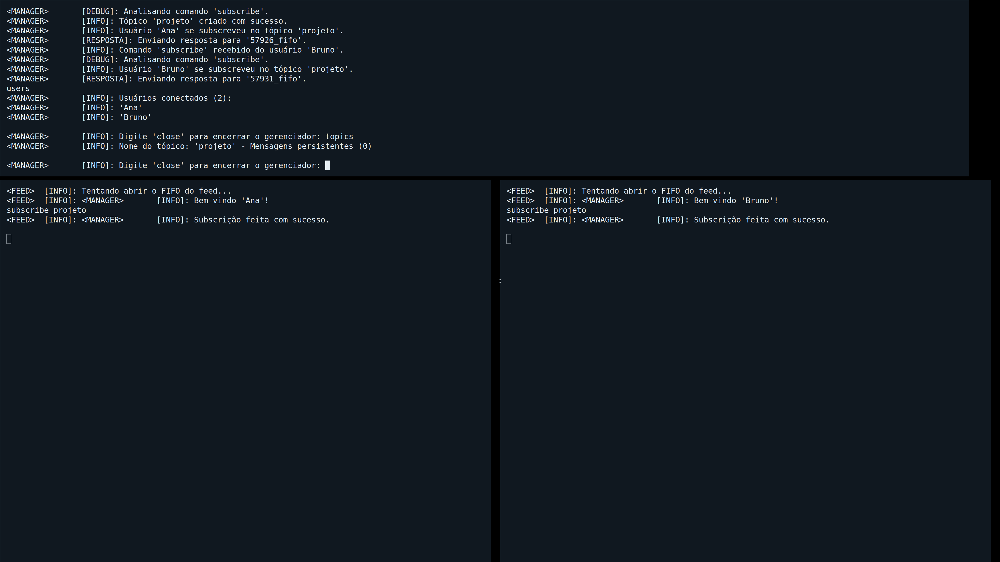</a>

Ver funcionalidades e implementação

- **Implementação:** gestor central, clientes independentes, sincronização e mensagens persistentes.
- **Demonstração:** execução real em terminal.

Ver demonstração animada

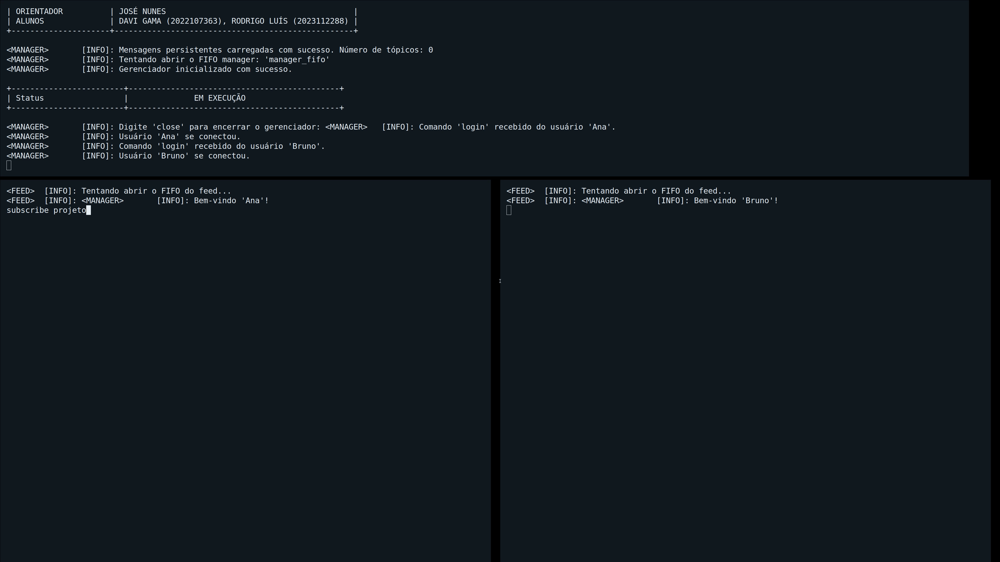

<a href="assets/portfolio/unix-broker.mp4">Vídeo da execução</a>

 

Ver arquitetura e detalhes técnicos

[Arquitetura](architecture/unix-broker.svg) | [Vista técnica](architecture/technical/unix-broker.svg) | [PNG da arquitetura](architecture/unix-broker.png)

### Windows IPC Word Game

**C | Sistemas operativos**

Jogo de palavras com vários processos Windows, jogadores, bots e painel de monitorização.

**Tecnologias:** C, Win32 API, named pipes, shared memory

<a href="assets/portfolio/windows-game-poster.webp">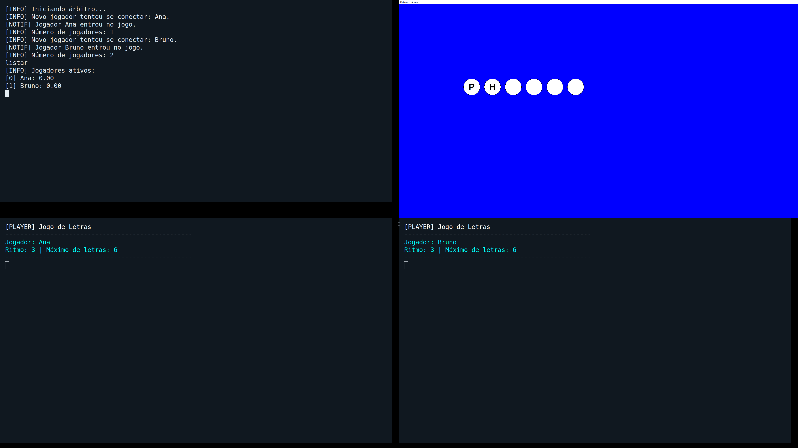</a>

Ver funcionalidades e implementação

- **Implementação:** comunicação entre processos, threads, sincronização e estado de jogo partilhado.
- **Demonstração:** execução dos componentes Win32.

Ver demonstração animada

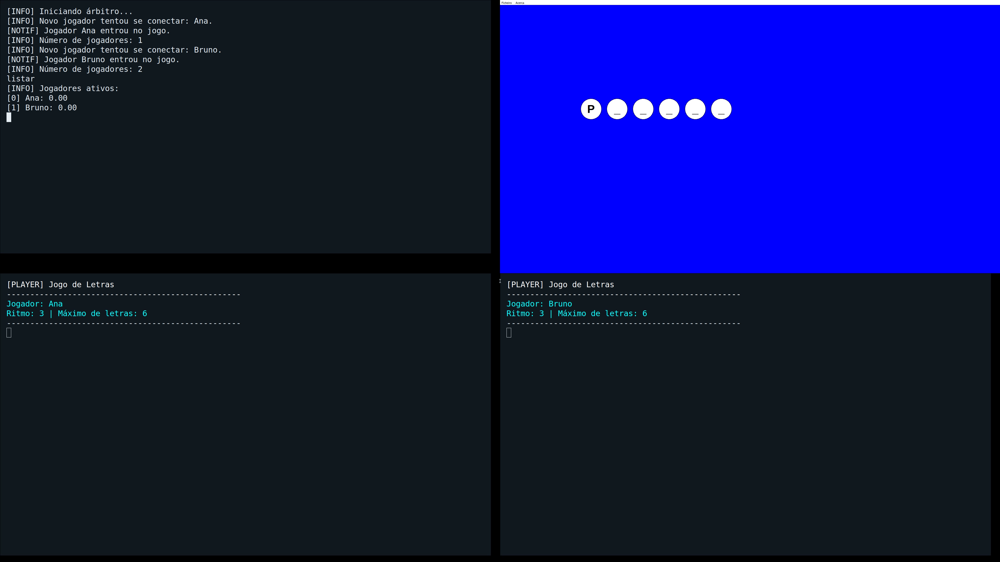

<a href="assets/portfolio/windows-game.mp4">Vídeo da execução</a>

 

Ver arquitetura e detalhes técnicos

[Arquitetura](architecture/windows-game.svg) | [Vista técnica](architecture/technical/windows-game.svg) | [PNG da arquitetura](architecture/windows-game.png)

### SafetySec Android

**Android | Académico**

Aplicação académica de acompanhamento e sinalização de emergência, com papéis de monitor e pessoa protegida.

**Tecnologias:** Android, Firebase

Ver funcionalidades e implementação

- **Interface:** painéis de monitorização e emergência.
- **Âmbito da demonstração:** interface com dados fictícios; sensores e serviços cloud não foram validados na captura.

Ver demonstração animada

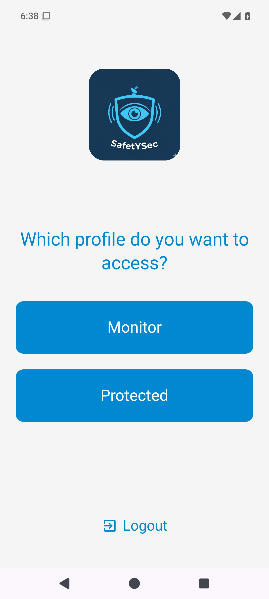

 

Ver arquitetura e detalhes técnicos

[Arquitetura](architecture/safetysec-android.svg) | [Vista técnica](architecture/technical/safetysec-android.svg) | [PNG da arquitetura](architecture/safetysec-android.png)

### Desert Caravan Simulator

**C++ | POO**

Simulador por turnos em terminal, com caravanas, cidades, recursos e comandos de movimentação.

**Tecnologias:** C++20, STL, POO

<a href="assets/portfolio/desert-caravan-poster.webp">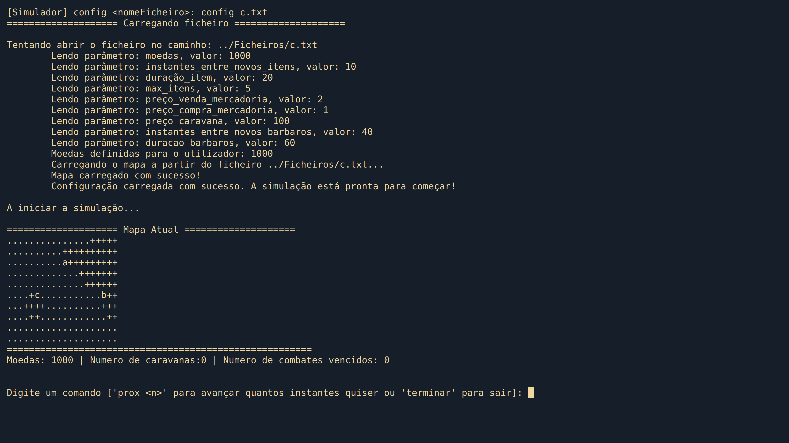</a>

Ver funcionalidades e implementação

- **Implementação:** classes para mapa, caravanas, comandos e evolução de turnos.
- **Demonstração:** execução real no terminal.

Ver demonstração animada

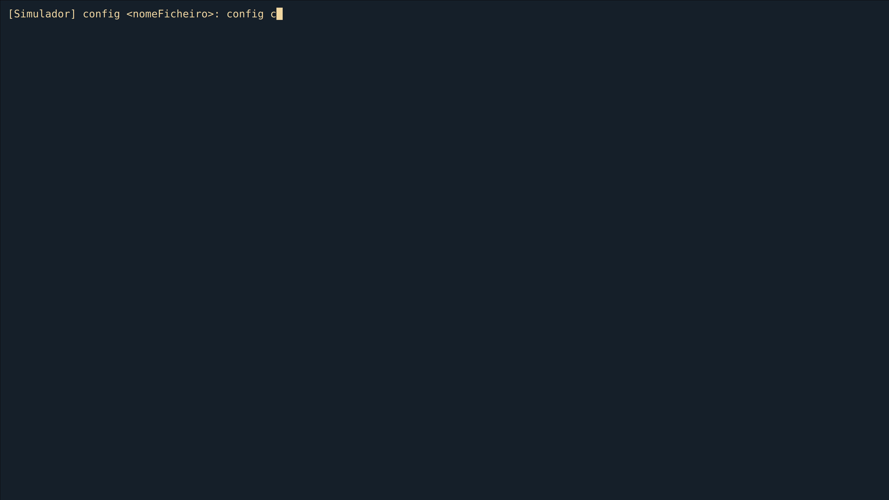

<a href="assets/portfolio/desert-caravan.mp4">Vídeo da execução</a>

 

Ver arquitetura e detalhes técnicos

[Arquitetura](architecture/desert-caravan.svg) | [Vista técnica](architecture/technical/desert-caravan.svg) | [PNG da arquitetura](architecture/desert-caravan.png)

**Outros estudos:** Neural Shape Classifier e AMOV Flutter.

## Frontend e websites

Sites para clientes com foco em design, conteúdo, navegação e SEO. Não são apresentados como aplicações com backend complexo. A plataforma do Thiago inclui uma integração simples com API de pagamentos.

### Coimbra MMA

**Website informativo | Frontend e design**

Site de uma academia de artes marciais em Coimbra. Reúne modalidades, horários, apresentação da academia e canais de contacto, com conteúdo em oito idiomas.

**Tecnologias:** Astro, JavaScript, i18n, SEO

<a href="assets/portfolio/coimbra-mma-poster.webp">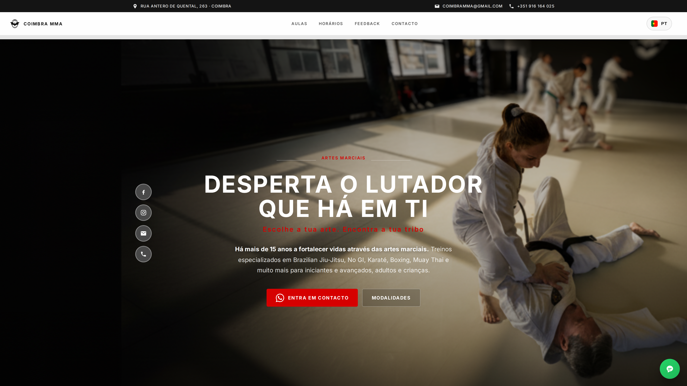</a>

Ver funcionalidades e implementação

- **Interface:** páginas responsivas, horários e assistente de modalidades.
- **Implementação:** páginas geradas estaticamente e validação das traduções. Não utiliza uma API de negócio.

Ver demonstração animada

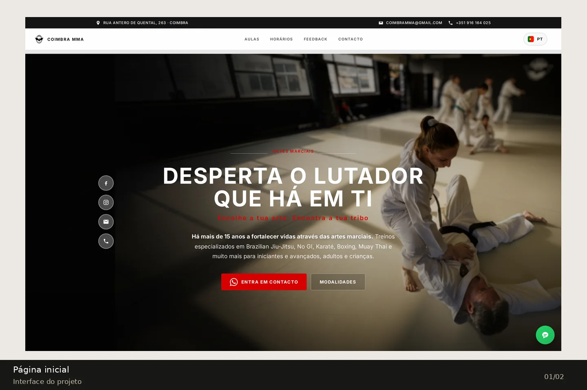

 

 

Ver arquitetura e detalhes técnicos

[Arquitetura](architecture/coimbra-mma.svg) | [Vista técnica](architecture/technical/coimbra-mma.svg) | [PNG da arquitetura](architecture/coimbra-mma.png)

### Marta | Her Legacy

**Website editorial | Frontend e design**

Site informativo para apresentação de serviços de mentoria, conteúdos, formulários de contacto e lista de espera de um planner. O trabalho concentrou-se na identidade visual, estrutura editorial e experiência de navegação.

**Tecnologias:** Next.js, React, TypeScript, CSS

Ver funcionalidades e implementação

- **Interface:** páginas responsivas, serviços, apresentação da marca, formulários e SEO.
- **Integração simples:** envio de contactos por email através de um serviço Spring Boot. Sem base de dados ou backend de negócio complexo.

Ver demonstração animada

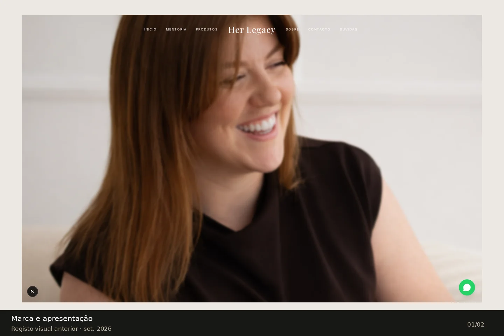

 

Ver arquitetura e detalhes técnicos

[Arquitetura](architecture/marta.svg) | [Vista técnica](architecture/technical/marta.svg) | [PNG da arquitetura](architecture/marta.png)

### Dalliany Tavares Advocacia

**Website editorial | Frontend e design**

Website informativo para apresentação da profissional e das áreas de atuação jurídica. Projeto orientado para design, navegação, conteúdos e presença digital.

**Tecnologias:** Astro, TypeScript, SEO

Ver funcionalidades e implementação

- **Interface:** páginas responsivas, conteúdo estruturado e imagens otimizadas.
- **Implementação:** geração estática sem backend de negócio complexo. Projeto em pré-lançamento, dependente de validações do cliente.

Ver demonstração animada

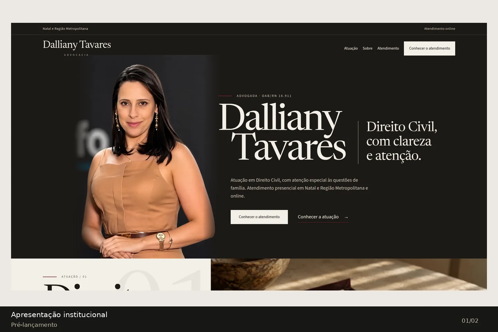

 

Ver arquitetura e detalhes técnicos

[Arquitetura](architecture/dalliany.svg) | [Vista técnica](architecture/technical/dalliany.svg) | [PNG da arquitetura](architecture/dalliany.png)

### Thiago Santos English Platform

**Website comercial | Frontend, design e pequena integração**

Site para apresentar um professor de inglês, divulgar cursos e ebooks e permitir a navegação por catálogo e carrinho. A maior parte do trabalho foi visual, com uma integração pontual de pagamento.

**Tecnologias:** Eleventy, Node.js, Express, Mercado Pago, Pix

<a href="assets/portfolio/thiago-poster.webp">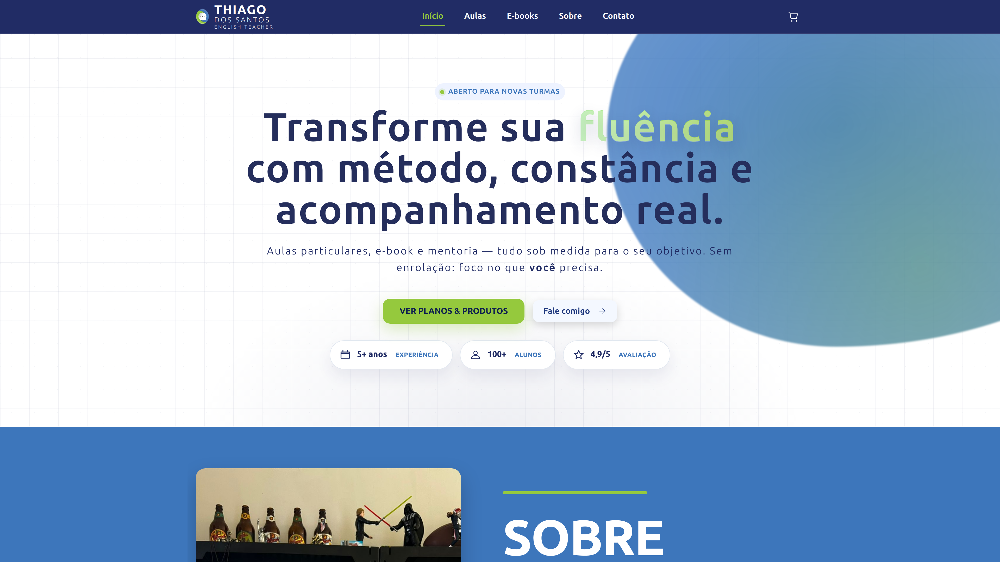</a>

Ver funcionalidades e implementação

- **Interface:** página inicial, cursos, ebooks, carrinho e contactos.
- **Integração simples:** endpoints Node.js/Express para o fluxo de pagamento com Mercado Pago e Pix. A demonstração pública não realiza transações.

Ver demonstração animada

 

Ver arquitetura e detalhes técnicos

[Arquitetura](architecture/thiago.svg) | [Vista técnica](architecture/technical/thiago.svg) | [PNG da arquitetura](architecture/thiago.png)

## Formação e experiência

- **Engenharia Informática, ISEC (2022 a 2026):** licenciatura com especialização em Desenvolvimento de Aplicações, concluída em julho de 2026.
- **Experiência empresarial (2026):** estágio curricular em engenharia de software, com desenvolvimento de APIs, integração de modelos de IA e colaboração em equipa.
- **Freelance (desde 2025):** websites e aplicações para clientes, com levantamento de requisitos, desenvolvimento e publicação.

Créditos dos diagramas e ícones: [atribuições](architecture/ATTRIBUTION.md).
