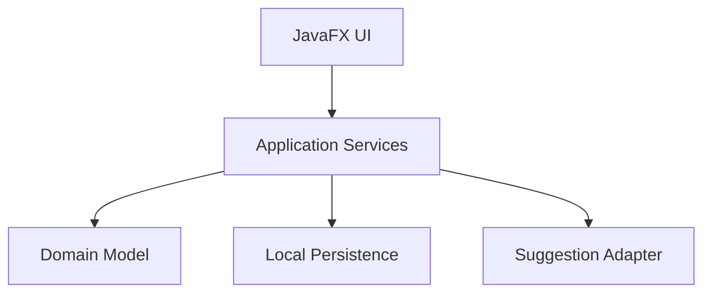

> **Academic Project: Instituto Superior de Engenharia de Coimbra (ISEC)**
>
> This public repository is a portfolio-ready version. The original academic submission is preserved separately in a private `-isec-archive` repository; later improvements may be present here.

<div align="center">

# SurpriseMe Gift Assistant

### JavaFX application for gift planning, recipient management and personalised suggestions


</div>

## Overview

**SurpriseMe Gift Assistant** is a JavaFX desktop application for organising recipients, occasions and gift history and for producing personalised gift and card-message suggestions.

The project was developed collaboratively at ISEC as an academic software-engineering project. This repository is presented for technical and portfolio review rather than as a commercial product.

The application focuses on object-oriented domain modelling, local persistence, UI separation, external-service abstraction and automated testing.

## Main Features

- User registration and authentication
- User profile management
- Recipient profiles
- Interests, preferences and relationship information
- Upcoming-event management
- Gift-history tracking
- Personalised gift suggestions
- Spontaneous gift suggestions
- Gift-card message suggestions
- Local persistence
- JavaFX desktop interface
- Automated tests for core domain behaviour

## Architecture

The application separates the main responsibilities into distinct areas.



| Area | Responsibility |
| --- | --- |
| JavaFX UI | Screens, navigation and user interaction |
| Domain model | Users, recipients, events, gifts and application rules |
| Application services | Coordinates workflows between the UI and model |
| Persistence | Stores and restores local application data |
| Suggestion adapter | Isolates the optional external recommendation integration |

The repository also contains UML diagrams, user stories and incremental planning artifacts from the academic development process.

## Technology Stack

| Area | Technology |
| --- | --- |
| Language | Java 21 |
| Desktop interface | JavaFX 21 |
| Build system | Apache Maven |
| Testing | JUnit 5 |
| Serialization | Jackson |
| Scheduling utilities | cron-utils |
| CI and quality | GitLab CI, SonarCloud configuration |

## Local Development

### Requirements

- JDK 21
- Apache Maven 3.9 or newer

Clone the repository:

```bash
git clone https://github.com/davigama-academic/surpriseme-gift-assistant-isec.git
cd surpriseme-gift-assistant-isec
```

Run the test suite:

```bash
mvn clean test
```

Start the desktop application:

```bash
mvn javafx:run
```

The optional suggestion integration uses local configuration based on `secrets.example.properties`.

Copy the example configuration to the expected local file and replace placeholders locally. Never commit real credentials.

## Testing

The repository includes automated tests for core domain behaviour.

Testing is focused on validating application rules independently from the JavaFX interface whenever possible.

Run:

```bash
mvn test
```

## Engineering Concepts Demonstrated

- object-oriented domain modelling
- separation of UI and domain concerns
- JavaFX desktop development
- local persistence
- external-service abstraction
- automated testing
- iterative development
- user stories and acceptance criteria
- collaborative version-control workflows

## Current Limitations

This repository represents an academic implementation and should not be interpreted as a production gift-recommendation platform.

The optional recommendation integration depends on local configuration and external-service availability.

## Academic Context

The project was developed collaboratively during the Computer Engineering degree at the **Instituto Superior de Engenharia de Coimbra (ISEC)**.

This public repository is a portfolio-oriented version. Improvements made after the academic submission may be present here.

## Contributors

- Celso André Ferreira Jordão
- **Davi Nasser Torres Gama**: [@DaviGama08](https://github.com/DaviGama08)
- Hugo Rafael da Assunção Gomes
- Rita Mariana Alves Henriques
- Rui Manuel Borges Casaca

Student numbers and academic email addresses are intentionally omitted from this public portfolio version.

## Licence

No open-source licence has been assigned.

The repository is available for portfolio and educational review. Reuse or redistribution requires permission from the authors.

---

<div align="center">

Developed as an academic software-engineering project.

</div>
