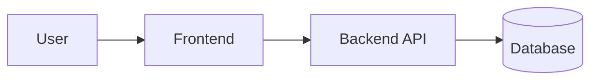

<div align="center">

# PROJECT NAME

### One clear sentence explaining what the project is and why it exists


</div>

> **Project type**
>
> One short note when context matters, for example: private production project, academic portfolio version, client project, open-source tool, or experimental project.

## Overview

**PROJECT NAME** is a concise description of the product or system.

Explain:

- the problem it solves
- who it is for
- the main engineering idea
- what makes the project relevant

Keep this section short enough that a recruiter or engineer can understand the project in less than a minute.

## Main Features

- Main capability
- Main capability
- Main capability
- Main capability
- Main capability

Only list features that are actually implemented.

## Screenshots

Add this section when the project has a relevant user interface.

Recommended structure:

```text
docs/screenshots/
├── home.webp
├── dashboard.webp
└── mobile.webp
```

Do not add placeholder screenshots or claim that a live demo exists when it does not.

## Architecture

Describe the architecture at a useful level without exposing unnecessary production-sensitive details.



Explain the main architectural decision in one or two paragraphs.

Examples:

- modular monolith instead of microservices
- static site generation instead of a dynamic frontend
- WebSocket only for real-time flows
- relational database because transactional consistency matters

## Technology Stack

| Area | Technology |
| --- | --- |
| Backend | Technology |
| Frontend | Technology |
| Persistence | Technology |
| Testing | Technology |
| Infrastructure | Technology |
| CI/CD | Technology |

Remove rows that do not apply.

Do not list planned technologies as if they were already implemented.

## Project Structure

Use this section when the repository structure helps explain the architecture.

```text
project/
├── backend/
├── frontend/
├── docs/
└── README.md
```

Explain only important directories.

## Local Development

### Requirements

- Runtime or SDK
- Package manager or build tool
- Database or external dependency, when required

### Setup

```bash
# install dependencies
command

# start dependencies
command

# run the application
command
```

Include only commands that have been verified.

## Configuration

Document required environment variables without exposing real values.

| Variable | Required | Purpose |
| --- | --- | --- |
| `EXAMPLE_VARIABLE` | Yes | Description |

Use placeholders such as:

```text
DB_PASSWORD=CHANGE_ME
```

Never commit or document real credentials, tokens or private keys.

## Testing and Quality

Explain the quality checks that actually exist.

```bash
# unit and integration tests
command

# lint or static analysis
command

# build verification
command
```

Possible topics:

- unit tests
- integration tests
- end-to-end tests
- architecture tests
- linting
- formatting
- static analysis
- dependency scanning
- container scanning

## Security

Include this section when security is materially relevant.

Document principles and controls, not secrets or unnecessary operational details.

Possible topics:

- authentication
- authorization
- tenant isolation
- password hashing
- secure cookies
- CORS
- CSRF
- rate limiting
- secret management
- dependency scanning

## Deployment

Include only when the project is deployed or has a real deployment process.

Describe the platform at a high level.

Example:

```text
Browser
  |
Cloudflare
  |
Frontend
  |
Backend API
  |
PostgreSQL
```

For private production systems, avoid documenting sensitive internal endpoints, credentials, exact security rules or unnecessary infrastructure details.

## Documentation

Link only to documentation that exists.

- Architecture
- API
- Security
- Deployment
- Database
- ADRs

## Engineering Decisions

Use this section for projects where architectural reasoning is part of the portfolio value.

Examples:

### Why a modular monolith?

Explain the requirement and tradeoff.

### Why PostgreSQL?

Explain the data and consistency requirements.

### Why WebSocket?

Explain why real-time communication is needed and why normal HTTP is still used elsewhere.

Avoid generic claims such as "because it is scalable".

## Current Limitations

Be explicit about meaningful limitations.

- Limitation
- Limitation
- Limitation

A technically honest limitation section is better than pretending the project is complete.

## Potential Improvements

List only realistic next steps.

- Improvement
- Improvement
- Improvement

Do not turn the README into a fictional roadmap.

## Project Context

Use one of the following approaches when relevant.

### Academic Project

> Academic Project: Instituto Superior de Engenharia de Coimbra (ISEC)

Explain the course, academic year and learning goals.

If the repository was improved after submission, state that clearly.

### Professional or Client Project

Explain that the repository is private when appropriate and avoid publishing confidential client information.

### Personal Product

Explain the product goal and current development status.

## Contributors

List contributors when the project was collaborative.

- **Name**: [@username](https://github.com/username)

Do not publish student numbers, private email addresses or unnecessary personal information.

## Licence

State the real licence.

If no open-source licence exists, say so explicitly.

Example:

No open-source licence has been assigned. The repository is available for portfolio and technical review only.

---

<div align="center">

Optional final one-line project description.

</div>
